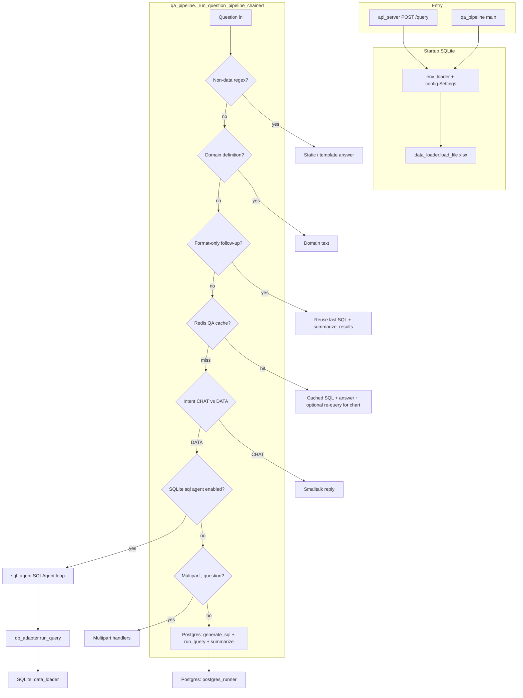

# SDA / Arcetus QA — request architecture

This document describes **what happens when a user question arrives**, **where answers come from**, and **which modules and files are involved**. Paths are relative to the **`Backend/`** folder unless noted.

---

## Entry points

| Path | Module | Role |
|------|--------|------|
| HTTP `POST /query` | `src/api_server.py` | Parses JSON (`question`, `session_id`, optional `prior_turns`), prepares `ConversationBuffer`, calls `run_question_pipeline_turn`. On startup (SQLite), **loads the workbook** via `data_loader.load_file`. |
| CLI | `src/qa_pipeline.py` (`main`) | Loads `.env`, loads workbook when `SDA_DATA_SOURCE` is SQLite, prompts in a loop, calls `run_question_pipeline_turn`. |
| Batch | `src/run_benchmark.py` | Same pipeline per row in `benchmark.xlsx`; not used in normal user traffic. |

---

## End-to-end flow (orchestration)

All paths converge on **`src/qa_pipeline.py`**:

- **`run_question_pipeline_turn`** — sets conversation context variable, calls **`_run_question_pipeline_chained`**, optional LangSmith flush.
- **`_run_question_pipeline_chained`** — **single router** for one user turn (fast paths → cache → intent → SQLite steward **or** Postgres SQL chain).

---

## Default mode: SQLite workbook (Arcetus sample)

When `db_adapter.use_sqlite_backend()` is **true** (default in `config.py`):

1. **`data_loader.py`** — Excel/CSV → **in-memory SQLite**; `get_db()` / `execute_query` serve all reads.
2. **`qa_pipeline._run_sqlite_sql_agent_turn`** (and multipart variant):
   - Optional **`workbook_schema_rag.py`** — retrieval over **loaded** table/column text.
   - **`sql_agent.py`** — iterative Azure steward: `<sql>` → validate → run → feed JSON results until `<done />` or max iterations.
   - **`sql_validator.py`** — SQL vs **loaded workbook** schema.
   - **`db_adapter.run_query`** — delegates to **`data_loader.execute_query`**.
3. **`qa_pipeline`** post-steps:
   - **`strip_sql_from_nl_chat_markup`** — remove SQL fences from NL unless `SDA_CHAT_INCLUDE_SQL=1`.
   - **`enrich_sqlite_steward_answer_from_grid`** — optional deterministic footers from result rows (`SDA_SQLITE_ANSWER_ENRICH`).
   - Chart / result-table payloads for the UI.

**Sources of truth for numbers:** executed SQL on the **in-memory DB** built from the file on disk.  
**Sources of truth for prose:** Azure + steward rules in `sql_agent.py`, optionally appended by enrichment.

---

## Postgres mode (`SDA_DATA_SOURCE=postgres`)

Same router until the **single-shot DATA** branch:

1. **`text_to_sql_prompt.py`** — builds NL→SQL prompts ( **`ERD.md`** + optional live table list).
2. **`schema_rag.py`** (+ **`embedding_rag_common.py`**) — optional embedding retrieval over ERD chunks (cache under `src/data/`).
3. **`sql_validate.py`** — read-only / dialect checks (sqlglot).
4. **`postgres_runner.py`** — run SQL, timeouts, live `information_schema` hints.
5. **`qa_pipeline.summarize_results`** — Azure summarization of row JSON into NL.

---

## `src/*.py` — responsibilities

| File | Responsibility |
|------|----------------|
| `api_server.py` | FastAPI, CORS, lifespan workbook load, `/health`, `/query`. |
| `qa_pipeline.py` | **Orchestration**: routing, Redis QA cache, intent, multipart, SQLite steward handoff, Postgres generate/run/summarize, charts, enrichment, conversation updates. |
| `sql_agent.py` | **Iterative workbook steward** (Azure, `<sql>` / `<done />`, `llm_rounds`, `all_queries`). |
| `text_to_sql_prompt.py` | Intent + text-to-SQL prompt builders; workbook vs ERD modes. |
| `db_adapter.py` | **Backend switch**: SQLite vs Postgres; unified `run_query`, catalog hints. |
| `data_loader.py` | Load file → SQLite; `get_db`, `execute_query`, table metadata. |
| `sql_validator.py` | Validate SQL against **workbook** `DatabaseState`. |
| `sql_validate.py` | sqlglot read-only / safety for pipeline SQL. |
| `workbook_schema_rag.py` | RAG index over **loaded** workbook schema. |
| `schema_rag.py` | RAG over **`ERD.md`** for Postgres NL→SQL. |
| `postgres_runner.py` | Postgres connection and query execution. |
| `conversation_context.py` | Turn buffer; optional Redis-backed history. |
| `redis_cache.py` | End-to-end QA cache (exact question → sql + answer + row_count). |
| `redis_config.py` | Redis settings. |
| `config.py` | `Settings` (paths, Azure, limits, CORS). |
| `env_loader.py` | Early `.env` load; Azure/Redis env aliases. |
| `langsmith_config.py` | Optional tracing. |
| `retry_utils.py` | Retries for external calls. |
| `pharma_schema.py` | ERD path / pharma helpers. |
| `generate_erd.py` | Script: introspect Postgres → `ERD.md`. |
| `run_benchmark.py` | Batch benchmark driver. |
| `embedding_rag_common.py` | Shared embedding/chunk helpers for RAG. |

---

## Static / config artifacts (not Python)

| Artifact | Used by |
|----------|---------|
| **`src/ERD.md`** | Postgres text-to-SQL + `schema_rag` (override: `SDA_ERD_PATH` / `ERD_PATH`). |
| **`src/value_hints.json`** | `sql_agent.py` — literal hints in steward system prompt. |
| **Arcetus workbook `.xlsx`** (default `Arcutis Dummy Data v1.xlsx`; see `Settings.data_file_path` / `DATA_FILE_PATH`) | `data_loader.load_file` at API/CLI startup (SQLite). |
| **`Backend/.env`** | Secrets and toggles via `env_loader` + `config`. |
| **`src/data/`** (generated) | RAG index caches for `schema_rag` / `workbook_schema_rag`. |

---

## Response shape (API)

`api_server` maps the pipeline dict to JSON (`success`, `response`, `sql`, `row_count`, `duration_ms`, etc.). Optional keys include `chart`, `result_table`, `cache_hit`, and (SQLite steward) `sql_agent_llm_rounds`, `sql_agent_sql_steps`, `error` when present.

---

## Related docs

- **`README.md`** — setup, env vars, how to run CLI vs `uvicorn`.
