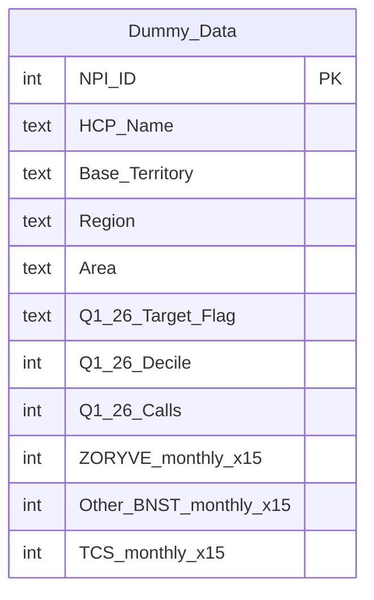

# Entity Relationship Diagram — Arcutis Workbook

This ERD describes the Excel dataset loaded from `Arcutis Dummy Data v1.xlsx` in workbook/SQLite mode.

## Sheet → SQLite Table Mapping

| Excel Sheet   | SQLite Table Name | Row Count (approx) | Description                        |
|---------------|-------------------|--------------------|------------------------------------|
| `Dummy Data`  | `Dummy_Data`      | ~39,932            | One row per HCP; all metrics flat  |

> The `Questions` sheet is metadata only and is **not** loaded into SQLite.

---

## Table Schema: `Dummy_Data`

This is the **primary and only** data table. Every query runs against `Dummy_Data`.

### SQL Table Name
```sql
"Dummy_Data"
```

### Column Reference

#### HCP Identity & Geography

| Column               | Type    | Description                                      | Example Values                   |
|----------------------|---------|--------------------------------------------------|----------------------------------|
| `NPI ID`             | INTEGER | National Provider Identifier (unique per HCP)    | 1225222862, 1689152357           |
| `HCP Name`           | TEXT    | Full name of the healthcare professional         | Christina Boull, Kelsey Nadeau   |
| `City`               | TEXT    | City of HCP practice                             | Minneapolis, Presque Isle        |
| `State`              | TEXT    | 2-letter state code                              | MN, ME, MI, TX                   |
| `Zip`                | TEXT    | ZIP code                                         | 55454, 4769                      |
| `Primary Specialty`  | TEXT    | HCP's primary medical specialty                  | DERMATOLOGY, NURSE PRACTITIONER  |
| `Secondary Specialty`| TEXT    | Secondary specialty (may be "-" if none)         | REGISTERED NURSE, -              |
| `HCO Name`           | TEXT    | Name of the healthcare organization/clinic       | M Health Fairview..., Forefront  |
| `Base Territory`     | TEXT    | Sales territory assignment                       | Minneapolis, MN; Manchester, NH  |
| `Region`             | TEXT    | Broad geographic region (14 regions)             | Midwest, New England, Florida    |
| `Area`               | TEXT    | East or West half of the US                      | East, West                       |

**14 Regions:** Florida, Great Lakes, Gulf Coast, Mid-Atlantic, Mid-South, Midwest, Mountain, New England, New York, Northwest, South Atlantic, Southeast, Southwest, Texas North

#### Targeting & Decile

| Column               | Type    | Values                                                         |
|----------------------|---------|----------------------------------------------------------------|
| `Q1'26 Decile`       | INTEGER | 1–10 (10 = highest prescribers) for Q1 2026                   |
| `Q4'25 Decile`       | INTEGER | 1–10 for Q4 2025                                               |
| `Q1'26 Target Flag`  | TEXT    | `Arcutis_Primary_Target`, `Arcutis_Non_Target`, `Kowa_Target` |
| `Q4'25 Target Flag`  | TEXT    | `Arcutis_Primary_Target`, `Arcutis_Non_Target`, `Kowa_Target` |

#### Rep Call Activity (Quarterly)

| Column         | Type    | Description                    |
|----------------|---------|--------------------------------|
| `Q2'25 Calls`  | INTEGER | Rep calls in Q2 2025           |
| `Q3'25 Calls`  | INTEGER | Rep calls in Q3 2025           |
| `Q4'25 Calls`  | INTEGER | Rep calls in Q4 2025           |
| `Q1'26 Calls`  | INTEGER | Rep calls in Q1 2026           |

#### ZORYVE TRx — Monthly (Jan 2025 – Mar 2026, 15 months)

Columns: `ZORYVE_Jan'25`, `ZORYVE_Feb'25`, `ZORYVE_Mar'25`, `ZORYVE_Apr'25`, `ZORYVE_May'25`, `ZORYVE_Jun'25`, `ZORYVE_Jul'25`, `ZORYVE_Aug'25`, `ZORYVE_Sep'25`, `ZORYVE_Oct'25`, `ZORYVE_Nov'25`, `ZORYVE_Dec'25`, `ZORYVE_Jan'26`, `ZORYVE_Feb'26`, `ZORYVE_Mar'26`

#### Other BNST TRx — Monthly (competitor brand, same 15 months)

Columns: `Other BNST_Jan'25` … `Other BNST_Mar'26`

#### TCS (Total Class Size) — Monthly (same 15 months)

Columns: `TCS_Jan'25` … `TCS_Mar'26`

TCS = ZORYVE + Other BNST + unlisted brands. **ZORYVE Share = ZORYVE / TCS**

---

## ER Diagram



---

## Query Patterns & Examples

> **CRITICAL:** Always double-quote column names containing spaces or apostrophes.

### ZORYVE TRx Trend (all 15 months)
```sql
SELECT
  SUM("ZORYVE_Jan'25") AS Jan_25, SUM("ZORYVE_Feb'25") AS Feb_25,
  SUM("ZORYVE_Mar'25") AS Mar_25, SUM("ZORYVE_Apr'25") AS Apr_25,
  SUM("ZORYVE_May'25") AS May_25, SUM("ZORYVE_Jun'25") AS Jun_25,
  SUM("ZORYVE_Jul'25") AS Jul_25, SUM("ZORYVE_Aug'25") AS Aug_25,
  SUM("ZORYVE_Sep'25") AS Sep_25, SUM("ZORYVE_Oct'25") AS Oct_25,
  SUM("ZORYVE_Nov'25") AS Nov_25, SUM("ZORYVE_Dec'25") AS Dec_25,
  SUM("ZORYVE_Jan'26") AS Jan_26, SUM("ZORYVE_Feb'26") AS Feb_26,
  SUM("ZORYVE_Mar'26") AS Mar_26
FROM "Dummy_Data"
```

### Primary vs Non-Target TRx Share (Q1'26)
```sql
SELECT
  "Q1'26 Target Flag",
  COUNT(*) AS HCP_Count,
  SUM("ZORYVE_Jan'26"+"ZORYVE_Feb'26"+"ZORYVE_Mar'26") AS ZORYVE_TRx,
  ROUND(100.0*SUM("ZORYVE_Jan'26"+"ZORYVE_Feb'26"+"ZORYVE_Mar'26")
    /NULLIF(SUM("TCS_Jan'26"+"TCS_Feb'26"+"TCS_Mar'26"),0),1) AS ZORYVE_Share_Pct
FROM "Dummy_Data"
GROUP BY "Q1'26 Target Flag"
ORDER BY ZORYVE_TRx DESC
```

### Region TRx Growth Q4'25 → Q1'26
```sql
SELECT Region,
  SUM("ZORYVE_Jan'26"+"ZORYVE_Feb'26"+"ZORYVE_Mar'26") AS Q1_26,
  SUM("ZORYVE_Oct'25"+"ZORYVE_Nov'25"+"ZORYVE_Dec'25") AS Q4_25,
  ROUND(100.0*(SUM("ZORYVE_Jan'26"+"ZORYVE_Feb'26"+"ZORYVE_Mar'26")-
               SUM("ZORYVE_Oct'25"+"ZORYVE_Nov'25"+"ZORYVE_Dec'25"))
    /NULLIF(SUM("ZORYVE_Oct'25"+"ZORYVE_Nov'25"+"ZORYVE_Dec'25"),0),1) AS Growth_Pct
FROM "Dummy_Data" GROUP BY Region ORDER BY Growth_Pct DESC
```

### Call Frequency vs TRx
```sql
SELECT "Q1'26 Calls" AS Calls, COUNT(*) AS HCP_Count,
  ROUND(AVG("ZORYVE_Jan'26"+"ZORYVE_Feb'26"+"ZORYVE_Mar'26"),2) AS Avg_ZORYVE_Q1_26
FROM "Dummy_Data" GROUP BY "Q1'26 Calls" ORDER BY "Q1'26 Calls"
```

### High TCS / Low ZORYVE Share (Switch Opportunities)
```sql
SELECT "NPI ID","HCP Name","Base Territory","Region",
  ("TCS_Jan'26"+"TCS_Feb'26"+"TCS_Mar'26") AS TCS_Q1_26,
  ("ZORYVE_Jan'26"+"ZORYVE_Feb'26"+"ZORYVE_Mar'26") AS ZORYVE_Q1_26,
  ROUND(100.0*("ZORYVE_Jan'26"+"ZORYVE_Feb'26"+"ZORYVE_Mar'26")
    /NULLIF(("TCS_Jan'26"+"TCS_Feb'26"+"TCS_Mar'26"),0),1) AS ZORYVE_Share_Pct
FROM "Dummy_Data"
WHERE ("TCS_Jan'26"+"TCS_Feb'26"+"TCS_Mar'26")>0
ORDER BY TCS_Q1_26 DESC, ZORYVE_Share_Pct ASC LIMIT 10
```

---

## Key Business Definitions

| Term              | Definition                                                              |
|-------------------|-------------------------------------------------------------------------|
| **TRx**           | Total prescriptions (new + refills)                                    |
| **ZORYVE**        | Arcutis branded product (roflumilast cream/foam)                       |
| **Other BNST**    | Competitor branded products in the same class                          |
| **TCS**           | Total Class Size = ZORYVE + Other BNST + other brands                  |
| **ZORYVE Share**  | ZORYVE TRx / TCS                                                       |
| **Primary Target**| `Arcutis_Primary_Target` — HCPs actively called on by Arcutis reps    |
| **Non-Target**    | `Arcutis_Non_Target` — HCPs not currently targeted                    |
| **Kowa Target**   | `Kowa_Target` — HCPs targeted under Kowa co-promote                   |
| **Decile**        | 1–10 ranking by TCS volume; 10 = highest prescribers                  |
| **Base Territory**| Rep territory in "City, STATE" format e.g. "Minneapolis, MN"          |

---

## Query Safety Notes

1. **Always double-quote** columns with spaces or apostrophes: `"NPI ID"`, `"HCP Name"`, `"Q1'26 Target Flag"`, `"ZORYVE_Jan'25"` etc.
2. **Only one table** — `Dummy_Data`. No JOINs needed.
3. Q1'26 = `Jan'26 + Feb'26 + Mar'26`; Q4'25 = `Oct'25 + Nov'25 + Dec'25`; Full year 2025 = sum all 12 `*'25` months.
4. Use `NULLIF(..., 0)` in denominators to avoid division-by-zero.
5. Target flag exact literals: `'Arcutis_Primary_Target'`, `'Arcutis_Non_Target'`, `'Kowa_Target'`.
